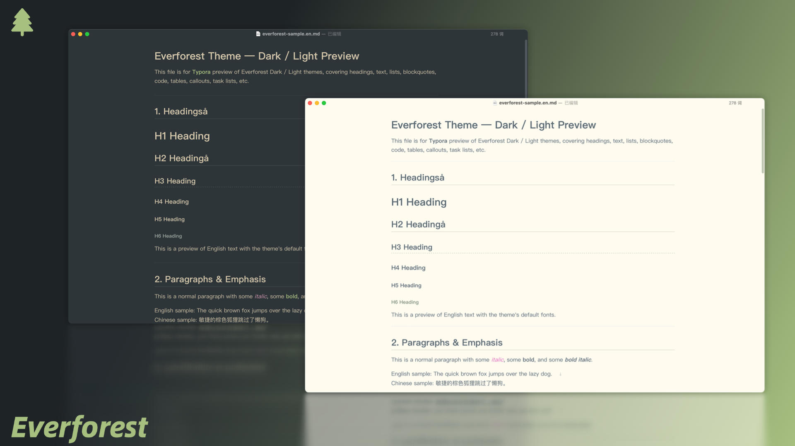
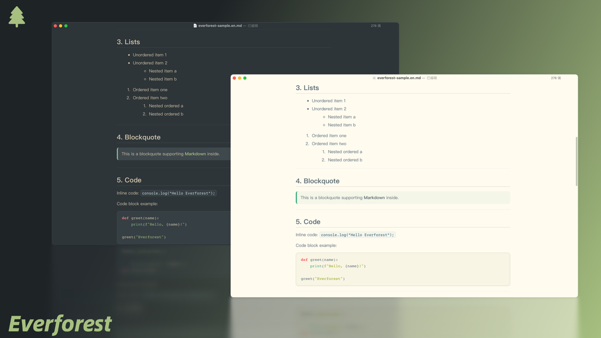
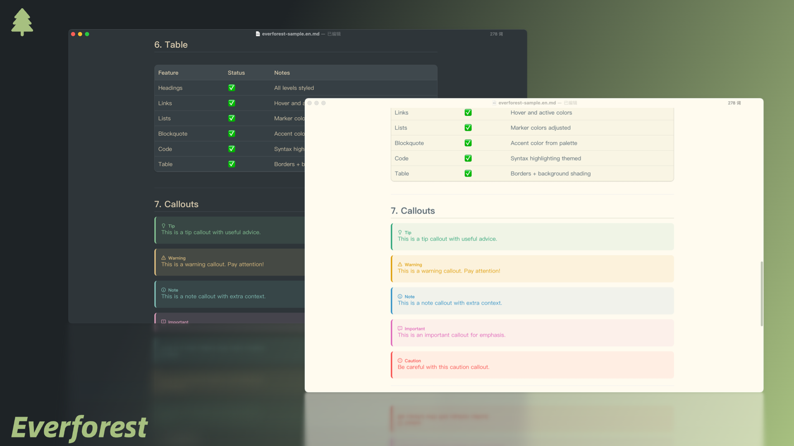
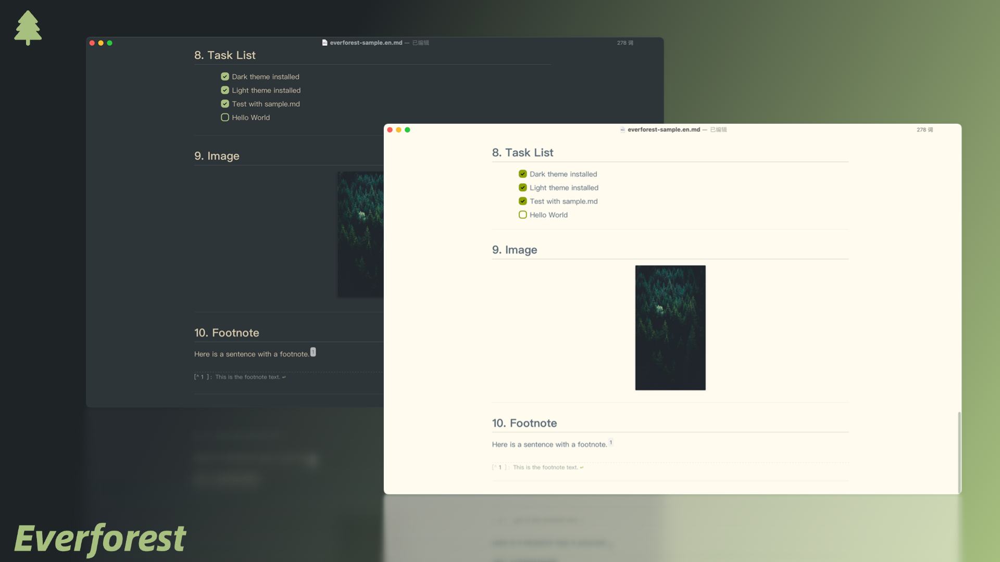

  

  
    

An implementation of [**EverForest**](https://everforest.vercel.app/) theme in [Typora](http://typora.io).

## Screenshots

## Installation

1. **Download the theme files**
   [Everforest Theme for Typora – Download](https://github.com/EthanBao27/everforest-typora/tree/main/themes)

2. **Locate Typora’s theme folder**

   - Open Typora → Preferences → Appearance → Open Theme Folder.

3. **Copy theme files**

   - Place the everforest.css file and its resources into the theme folder.

4. **Apply the theme**

   - Restart Typora, then select **Everforest** from the Themes menu.

## Special Thanks

- The Callouts styles are inherited from [Mdmdt Theme](https://theme.typora.io/theme/Mdmdt/), thanks to @cayxc for contributing such beautiful theme.

## Links

- **Homepage:** [Everforest Typora Theme Repository](https://github.com/EthanBao27/everforest-typora)
- **Download:** [Everforest Typora Theme – themes folder](https://github.com/EthanBao27/everforest-typora/tree/main/themes)

# License

[Apache 2.0](./LICENSE)
